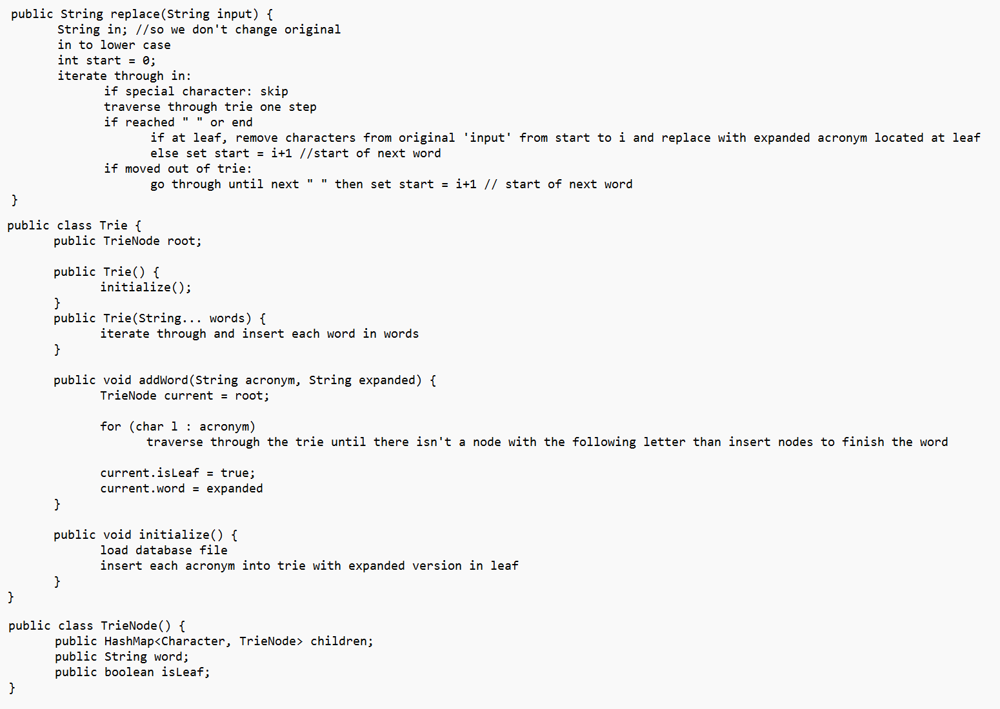
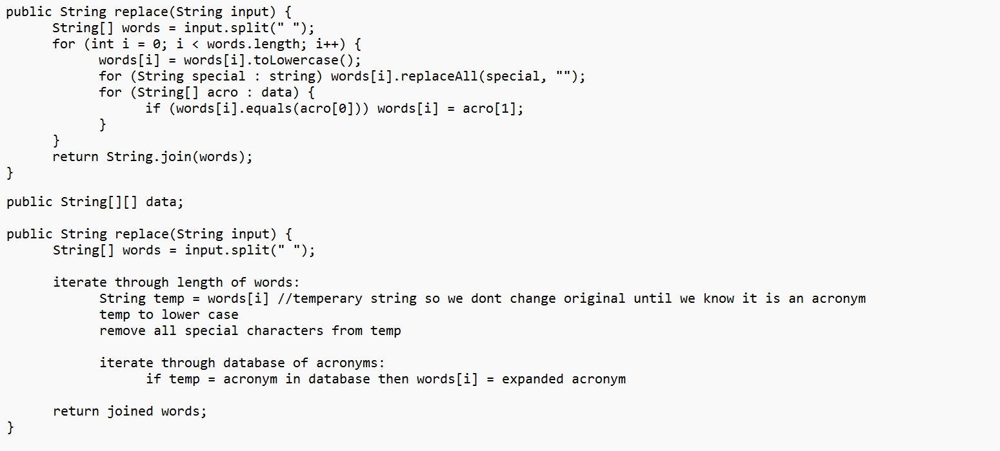
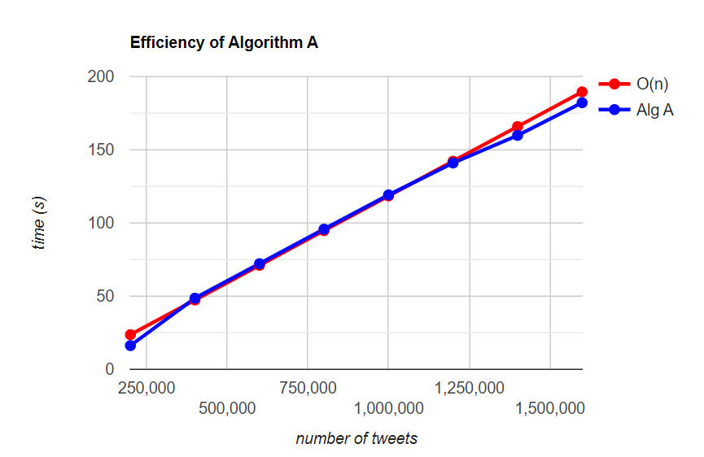
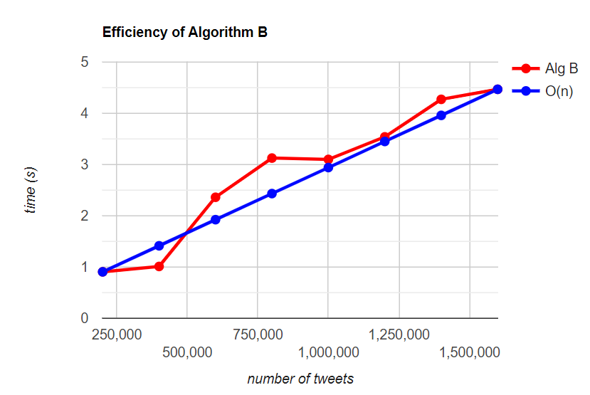
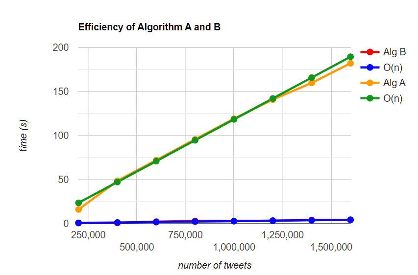

# COSC 320 - Project Topic 1

For our project, we chose the first project topic of creating two algorithms to take in a variable sized dataset of plain english text with acronyms, and expand any acronyms found into their full english counter parts. This project was done as a practise in identifying and implementing efficient solutions to large algorithm design problems.

# Data-Sets

For this project, we used two main datasets. the first is an expanded acronym dataset, containing 62,441 samples of acronyms, and their expanded english meanings. Our second dataset choice was a twitter sentiment based aggregation, containing 1.58 million unique tweets to be parsed. These datasets were chosen as we beleived tweets would contain a large proportion of acronyms within them due to the character limiation of the platform, aswell as the short format casual writing style twitter is known for.

# Algorithms

Our first algorithm approach was a initial naive attempt at creating a solution to the presented project task. We created this algorithm with the intent to ingest both an acronym dataset and a twitter sentiment dataset, and parse the required columns from both into individual two dimensional arrays. Once done, our algorithm would then iterate through each tweet, breaking the full string into individual words to be checked against our acronym array. When an acronym matching sequence of characters is found, the acronym would be replaced with its expanded version, and then the alghorithm would continue to the next word. Once the tweet is finished being read, each word would be stiched back together, before moving on to the next tweet entry in the array. Once finished, a final time taken in milliseconds is outputted to console.

For our second algorithm, Our main focus was on increasing efficiency compared to our naive algorithm implementation by implementing a Hash table and Trie based data structure for storing our acronym list. As the time taken to travers Trie data structure was drastically more efficient then spanning through a two dimensional array, it lead to large improvments in runtime compared to our first algorithm design.

Enclosed below are our pseudo code implementations of both Algorithm A, and Algorithm B, aswell as the runtime graphs showing the runtime scaling based on tweet dataset size inputted into both algorithms, and a comparison of runtime between both algorithms.

## Algorithm A:

## Algorithm B:

## Algorithm A Efficiency:

## Algorithm B Efficiency:

## Algorithm A vs. Algorithm B efficiency

